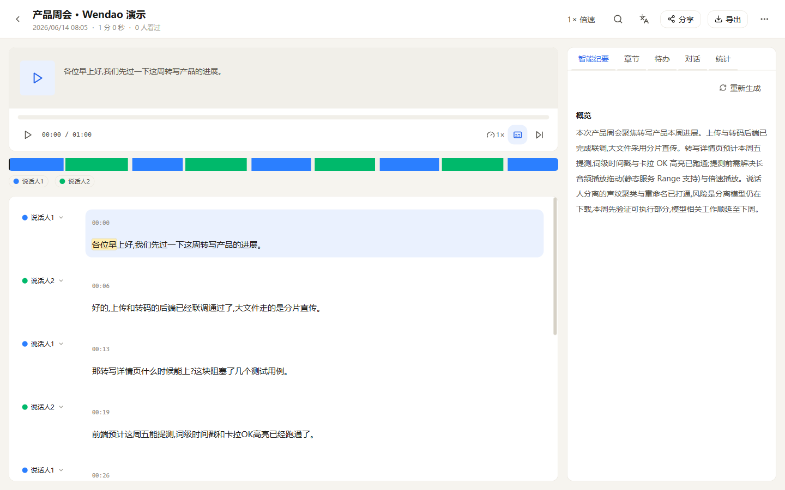
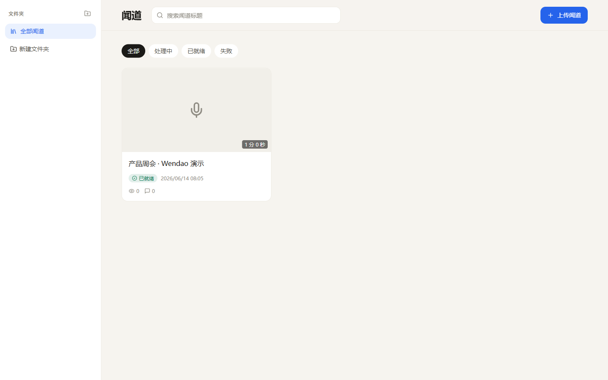

<div align="center">

# 闻道 · Wendao

**Self-hosted meeting & media transcription with speaker diarization and AI minutes.**

A privacy-first, fully self-hosted alternative to Feishu Minutes / Otter.ai — your recordings, your GPU, your data.

[](LICENSE)
[](https://github.com/wuji-labs/wendao/actions/workflows/ci.yml)
[](CONTRIBUTING.md)
[](https://github.com/wuji-labs)

English · [简体中文](README.zh-CN.md)

</div>

> [!NOTE]
> Wendao runs entirely on your own infrastructure. Transcription uses open Whisper-family models on your GPU; AI minutes use your local [Ollama](https://ollama.com). No audio, transcript, or meeting content ever leaves your servers.

<p align="center">
  
  <br/>
  <em>Transcript with word-level karaoke highlighting, speaker diarization, a synced player, and on-demand AI minutes — all self-hosted.</em>
</p>

<p align="center">
  
  <br/>
  <em>Library — folders, full-text search, and processing status at a glance.</em>
</p>

## ✨ Features

- **🎙️ Upload → transcribe.** Drop in audio or video; get an automatic transcript with **word-level timestamps**.
- **🗣️ Speaker diarization.** Cluster speakers by voiceprint, rename `Speaker 1 → real name`, and re-assign segments.
- **▶️ Synced playback.** Click any word to jump the player; karaoke-style word highlighting; playback speed, skip-silence, captions (CC) and bilingual captions.
- **🤖 AI minutes (local LLM).** On-demand summary + key points + risks, chapter breakdown, action-item extraction (with owners), and auto-title — each with **clickable source citations** back to the transcript.
- **💬 Chat with your transcript.** Ask questions and get answers grounded in the recording, with cited line numbers.
- **🤝 Collaboration.** Highlights, per-segment comments, shareable clips, and link-scope permissions.
- **✍️ Editing.** Fix transcript text and tidy up paragraphs directly.
- **🌐 Translation.** Translate transcripts (zh / en / ja) and produce bilingual transcripts.
- **📊 Organize & analyze.** Folders, full-text search, in-transcript search; per-speaker talk-time / share / word-count and access/comment stats.
- **📤 Export.** TXT / SRT / Markdown / DOCX (speaker labels and timestamps optional).

> AI minutes are generated **on demand** (not as a blocking pipeline step), so the transcript is available the moment segmenting finishes — the LLM never delays it.

## 🏗️ Architecture

```
                          ┌──────────────────────────────────────────┐
                          │  Browser (Next.js 16 web · :3101)          │
                          └───────────────┬──────────────────────────┘
                       same-origin proxy  │  (large uploads go direct)
                          ┌───────────────▼──────────────────────────┐
                          │  API · Fastify + tRPC v11 (:3100)          │
                          │  + pipeline worker                         │
                          └───┬─────────┬──────────┬──────────────────┘
                   Postgres   │   ASR   │   Ollama │   local storage
                  (16 tables) │  :9400  │  :11434  │  (media + artifacts)
                              ▼
                   Python FastAPI · WhisperX / faster-whisper + diarization
```

Five workspace packages (pnpm + Turborepo):

| Package                     | Role                                                       | Port |
| --------------------------- | ---------------------------------------------------------- | ---- |
| `apps/miaoji`               | Next.js 16 / React 19 web frontend                         | 3101 |
| `packages/miaoji-api`       | Fastify 5 + tRPC v11 + Drizzle backend (+ pipeline worker) | 3100 |
| `apps/miaoji-asr`           | Python FastAPI ASR + diarization microservice              | 9400 |
| `packages/miaoji-contracts` | Shared Zod schemas — the cross-language source of truth    | —    |
| `packages/miaoji-web-ui`    | Shared React UI components                                 | —    |

> The directory/package codename is `miaoji`; the product is **Wendao**. They map 1:1.

See **[docs/architecture.md](docs/architecture.md)** for the full design.

## 🚀 Quick start

### Prerequisites

- **Node** ≥ 20 and **pnpm** ≥ 9 (`corepack enable`)
- **PostgreSQL** 16 (Docker Compose included)
- **ffmpeg** / **ffprobe** on `PATH`
- **[Ollama](https://ollama.com)** with a model pulled (default `qwen3:30b-a3b`) — for AI minutes / translation / Q&A
- For transcription: **Python 3.11/3.12** and a **CUDA GPU** (CPU works but is slow). See [`apps/miaoji-asr/README.md`](apps/miaoji-asr/README.md).

### Run with Docker Compose

```bash
git clone https://github.com/wuji-labs/wendao.git
cd wendao
# Create your .env from .env.example and review the defaults.

# Node stack (postgres + api + worker + web)
docker compose up -d postgres api worker web
docker compose exec api pnpm -F @wuji/miaoji-api db:migrate

# The GPU ASR service is optional and profile-gated (needs the NVIDIA runtime):
# docker compose --profile asr up -d asr
```

Open <http://localhost:3101>.

### Run manually (dev)

```bash
pnpm install
# Create your .env from .env.example (see docs/configuration.md).

docker compose up -d postgres                 # or your own Postgres
pnpm -F @wuji/miaoji-api db:migrate
pnpm -F @wuji/miaoji-api db:seed              # dev user
pnpm db:seed:demo                            # optional: a ready-made demo minute

pnpm -F @wuji/miaoji-api dev                  # API     :3100
pnpm -F @wuji/miaoji-api dev:worker           # worker
pnpm -F @wuji/miaoji-web dev                  # web     :3101

# ASR service (separate process; needs GPU + models)
cd apps/miaoji-asr && ./run.ps1               # or: uvicorn app.main:app --host 0.0.0.0 --port 9400
```

Full self-hosting guide: **[docs/self-hosting.md](docs/self-hosting.md)** · Configuration reference: **[docs/configuration.md](docs/configuration.md)**.

## 🔄 How it works

Each upload runs through a state machine:

```
UPLOADING → TRANSCODING (ffmpeg) → TRANSCRIBING (ASR) → DIARIZING → SEGMENTING → READY
```

AI minutes (summary / chapters / to-dos) are then generated on demand via the local LLM. If the LLM is unavailable, the transcript still works — AI features degrade gracefully. The same is true for diarization: if no diarization backend is configured, you still get a full transcript without speaker labels.

## 🧩 Tech stack

Next.js 16 · React 19 · Fastify 5 · tRPC v11 · Drizzle ORM · PostgreSQL 16 · Zod · Turborepo · FastAPI · WhisperX / faster-whisper · pyannote / DiariZen · Ollama.

## 📁 Project structure

```
wendao/
├─ apps/
│  ├─ miaoji            # Next.js web frontend
│  └─ miaoji-asr        # Python ASR + diarization service
├─ packages/
│  ├─ miaoji-api        # Fastify + tRPC + Drizzle backend (+ worker)
│  ├─ miaoji-contracts  # Shared Zod schemas (SSOT)
│  └─ miaoji-web-ui     # Shared React UI
├─ docs/                # architecture, self-hosting, configuration, models, roadmap
└─ docker-compose.yml
```

## ⚠️ Status & limitations

Wendao is **pre-1.0** and was built for self-hosted/trusted-network use. Please read before deploying publicly:

- **Authentication is intentionally minimal** — a simple `x-user-id` header suitable for a trusted LAN. **Put a real auth layer / reverse proxy in front before exposing it to the internet.**
- **The UI is currently zh-CN only.** English/i18n is a welcomed, high-value contribution — see [docs/roadmap.md](docs/roadmap.md).
- Code comments are a mix of Chinese and English (the project originated in a Chinese-speaking team).
- ASR models download on first use and need a CUDA GPU for practical speed.

See **[docs/roadmap.md](docs/roadmap.md)** for what's planned and where help is wanted.

## 🤝 Contributing

Contributions of every size are welcome — see **[CONTRIBUTING.md](CONTRIBUTING.md)**. Please also read our **[Code of Conduct](CODE_OF_CONDUCT.md)**. For security issues, follow **[SECURITY.md](SECURITY.md)** (do not open public issues).

## 📜 License

[MIT](LICENSE) © 2026 WUJI (wuji-labs).

> **Model licenses are separate.** The default diarization path (`DiariZen meeting-base`) is MIT, but some optional DiariZen weights are **CC-BY-NC-4.0 (non-commercial)** and pyannote requires accepting its terms with a Hugging Face token. See **[docs/diarization-and-models.md](docs/diarization-and-models.md)** before commercial use.

## 🙏 Acknowledgements

Built on the shoulders of [OpenAI Whisper](https://github.com/openai/whisper), [WhisperX](https://github.com/m-bain/whisperX), [faster-whisper](https://github.com/SYSTRAN/faster-whisper), [pyannote.audio](https://github.com/pyannote/pyannote-audio), [DiariZen](https://github.com/BUTSpeechFIT/DiariZen), and [Ollama](https://ollama.com). Product inspiration from Feishu Minutes and Otter.ai.

<div align="center">

Made with care by **WUJI Labs**.

</div>
